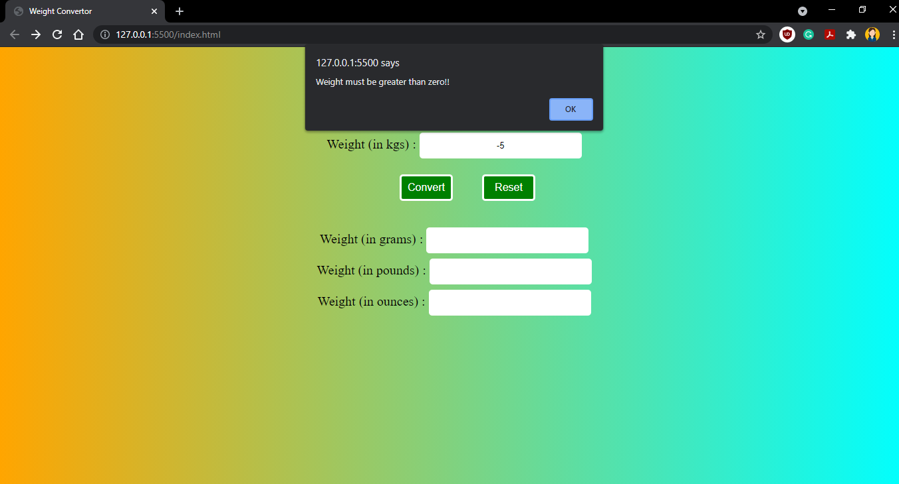
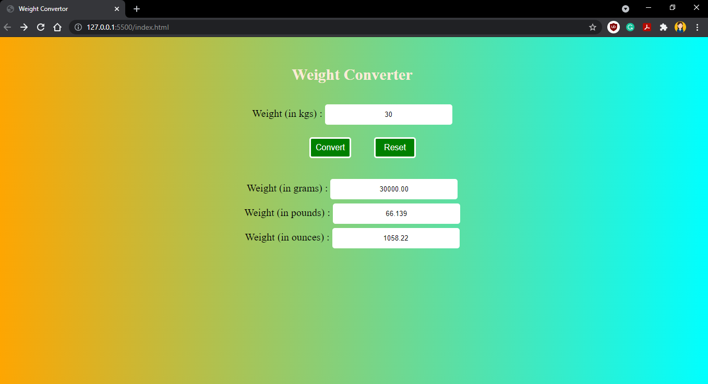

# Weight Converter
A simple weight converter project in which the user enters the weight in kilograms and it gets converted to 
grams, pounds and ounces.

# Use of Project
A beginner-friendly project to get started with web development. 

# Stack Used
- JavaScript
- React-Native

# Set up required to run

- Clone this repo.
- Move to project directory. Open it with your code IDE.
- From your IDE, open .html file in browser.

# Screenshots

a. When we don't enter any value or the value is less than or equal to zero then an alert appears.

b. When we enter a valid value then it gets converted on clicking convert button.

c. On clicking Reset button, the fields will get cleared.
